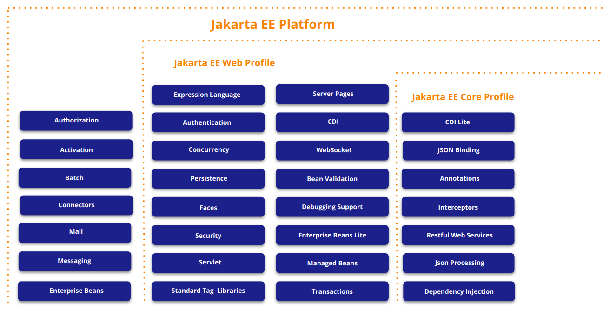
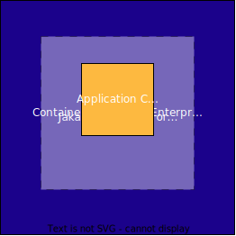
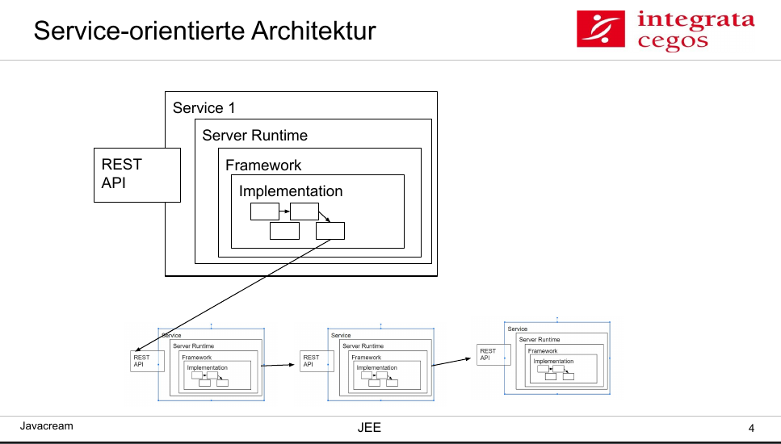
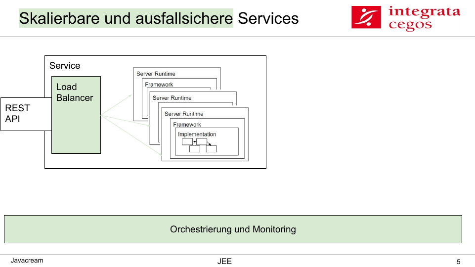
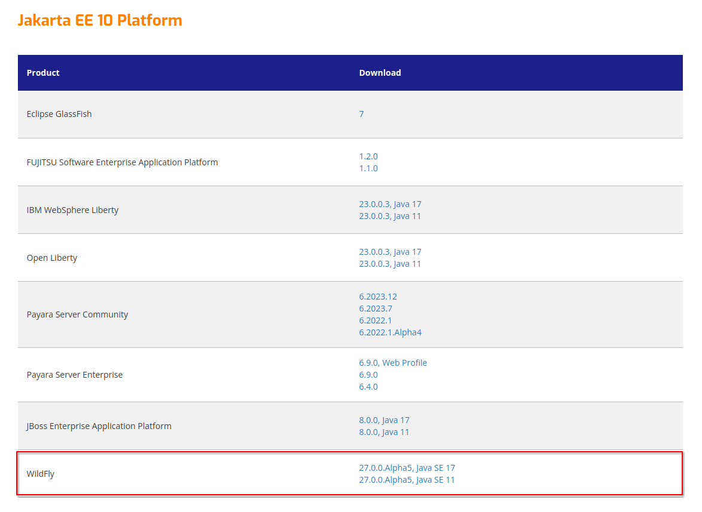
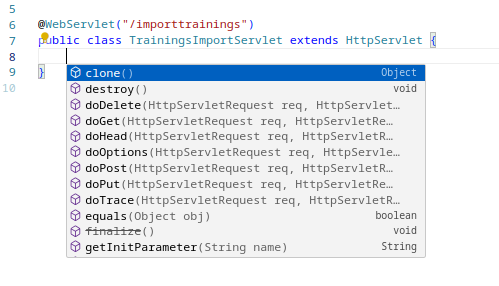

<style>
header {
  text-align: right;
  margin: 20px;
  left: 0px;
  right: 0px;
  border-top: 2px;
}
footer {
  font-size: 0.7rem;
}
section.lead {
  text-align: center;
}
section {
  font-size: 1.2rem;
}
section.lead h1 {
  font-size: 2.0rem;
}
h2 {
  position: absolute;
  top: 10px;
  padding-top: 15px;
  text-transform: uppercase;
}
section.quote {
  font-size: 1.0rem;
  text-align: center;
}

section.linked footer {
  display: none;
}

section.linked header {
  display: none;
}
</style>

<!-- _class: lead -->
# Jarkarta Enterprise

Zusatzmaterial

---
## Aktuelle Links
* [Material zum Training](https://github.com/Javacream/org.javacream.training.jee)
* [Spezifikationen](https://jakarta.ee/specifications/)
    * [Jakarta EE 10](https://jakarta.ee/specifications/platform/10/jakarta-platform-spec-10.0)
* [Code Generator](https://start.jakarta.ee/)
* [Offizielles Tutorial](https://jakarta.ee/learn/docs/jakartaee-tutorial/current/index.html)

---
# 1 Übersicht

---
## 1.1 Übersicht Bestandteile

<!-- _class: quote -->
[COPYRIGHT (C) 2023, ECLIPSE FOUNDATION. | THIS WORK IS LICENSED UNDER A CREATIVE COMMONS ATTRIBUTION 4.0 INTERNATIONAL LICENSE (CC BY 4.0)](https://docs.google.com/presentation/d/1LBjjJg64j0HjmFu6m3EApN--mkavemyPFMUobIbGZds)

---
## 1.1 Übersicht Varianten
### Profile
* Core
* Web
* Platform

### Artefakttypen:
* EAR - Enterprise Application Archive
  * kann WAR und JAR Dateien beinhalten
* WAR - Web Application Archive
* RAR - Resource Archive
* JAR - Java Archive
### Auslieferungsmöglichkeiten
* Installation von WAR oder EAR Dateien auf einen JEE Server
* Fat-JAR/Uber-JAR, welches Anwendung + JEE-Plattform enthält
  * sinnvoll für Installationen als Docker-Image (z.B. für Kubernetes Cluster)

---
## 1.1 Wissenscheck

* Nennen Sie 6 Bestandteile von Jakarta EE
* Welche Profile gibt es. Nennen Sie pro Profil ein Bestandteil, was enthalten ist und eines was nicht enthalten ist.
* Welche Auslieferungsmöglichkeiten gibt es?

---

# Zusatz Architekturen

---
## Architekturen - Applikation & Runtime

https://jakarta.ee/learn/docs/jakartaee-tutorial/current/intro/overview/overview.html#_footnotedef_3
<!-- _class: quote -->

---
<!-- _class: quote -->
## Architekturen - 3 Schicht

https://jakarta.ee/learn/docs/jakartaee-tutorial/current/intro/overview/overview.html#_footnotedef_3

---
<!-- _class: quote -->
## Architekturen

https://jakarta.ee/learn/docs/jakartaee-tutorial/current/intro/overview/overview.html#_footnotedef_3

---
<!-- _class: linked -->

[Material zum Training](https://github.com/Javacream/org.javacream.training.jee)

---
<!-- _class: linked -->

[Material zum Training](https://github.com/Javacream/org.javacream.training.jee)

---
# 1.2 Spezifikation und Hersteller

---
<!-- _class: quote -->
## Jakarta EE 10 Server Kompatibilität

https://jakarta.ee/compatibility/download/ | [Spezifikationen](https://jakarta.ee/specifications/) | [Jakarta EE 10](https://jakarta.ee/specifications/platform/10/)

---
## Übung zu 2.1: Applikationsserver/Arbeitsweise
<!--
Seite 45 - erste Übung
-->
### Ziel: 
* Installation einer Applikationsserver + Applikation über das wildfly-maven-plugin
* Überblick der Services über die Managementkonsole des Applikationsservers

### Schritte
* Checken Sie das Projekt aus und gehen Sie in den Ordner examples/trainings
* Starten Sie den Wildfly + Applikation wie in der README.md beschrieben
* Finden Sie unter Deployments heraus, welche Anwendungen deployt sind
* Finden Sie über Configuration die benutzten Ports heraus
* Finden Sie unter Runtime heraus, wieviel Rest-Endpoints zur Verfügung stehen
* Nennen Sie einige Services, die Sie auf der Managementoberfläche finden und ihre Bedeutung

---

## Übung zu 2.3: Deployment

### Ziel:
* Erste Schritte mit dem Wildfly Server, Durchspielen verschiedener Deployment-Arten.

### Schritte:

Über das wildfly-maven-plugin haben Sie im vorherigen Schritt bereits ein Wildfly Server heruntergeladen. Nun wollen wir diesen Standalone starten.

* Kopieren Sie sich die den Ordner server im target-Verzeichnis.
* Starten sie den Server mit ./bin/standalone.sh bzw. bin/standalone.bat
* Deployen Sie die WAR-Datei aus Ihrem target-Verzeichnis manuell
* Löschen Sie Ihr Deployment wieder und deployen Sie die Anwendung erneut, indem Sie sie in das Verzeichnis deployments des Servers legen

---

## Übung zu 2.4: Administration

### Ziel:
* Administration über UI und standalone.xml

### Schritte:

* Legen Sie unter Configuration eine H2-Datenbank an. 
* Schauen Sie sich an, wie sich die Serverkonfiguration unter server/standalone/configuation/standalone.xml geändert hat
  * Vieviel Datenbank Connection stehen im Connection-Pool zur Verfügung?

---
## Kapitel 2 - Wissenscheck

* Welche Arten des Deployments gibt es?
* Wie erreicht man die Administrationsoberfläche vom Wildfly (URL, Port)?
* Nennen Sie 2 Einstellungsmöglichkeiten in der Administrationsoberfläche
* Was muss man machen, um eine Postgres-Datenbank verwenden zu können?

---
# 4 Programmierung von Jakarta EE Anwendungen

---
## Diskussion zu 4.2 Fokus und typische Beispiele

* Welche typischen Anwendungen kennen Sie in Ihrer Umgebungen?
* Was sind die großen Vorteile von Jakarta EE Anwendungen?
* Auf welche Probleme sind Sie bereits gestoßen (Benutzung, Betrieb, Entwicklung)?

---

# 5 Das Programmiermodell

---
## Basis: Microprofile Config - Übung

### Ziel
* Konfigurationsparameter in eine Applikation hineingeben
### Aufgabe
* Lege unter dem Verzeichnis resources/META-INF eine property-Datei namens microprofile-config.properties an
* Definiere eine property, z.B. default-name=Mustermann
* In der Klasse HelloWorldResource
  * Füge die oben gesetzte Config-Property hinzu
  * Lass dir den default-name statt des Strings „world“ ausgeben, falls kein Namen in der Methode übergeben wurde
* Teste das Ergebnis mit dem Browser

---
## Basis / Web: Servlet

Jakarta Servlets sind eine einfache Art, HTTP-Anfragen als Java-Objekte entgegenzunehmen, ein Java-Objekt als HTTP-Antwort anzubieten und den gesamten Lebenszyklus um sie herum zu verwalten.



---
## Basis / Web: Servlet - Übung

### Ziel
Web Servlet erstellen

### Aufgabe
Wir wollen eine Website mit Trainingsangeboten erstellen. Dazu möchten wir einen Trainingskatalog (csv-Datei) einlesen.

### Hinweis
* Überschreiben Sie die doPost()-Methode in der Klasse TrainingsImportServlet.
* Geben Sie die eingelesenen Daten im log/auf der Konsole aus. Wir werden sie später verarbeiten.

---
## Core: Json Binding & Processing

Jakarta Json Binding stellt ein Default-Mapper für die Serialisierung und Deserialisierung von Java-Objekten bereit.

https://javaee.github.io/jsonb-spec/getting-started.html

```java
Jsonb jsonb = JsonbBuilder.create();

Person person = new Person();
person.name = "Fred";

Jsonb jsonb = JsonbBuilder.create();

// serialize to JSON
String result = jsonb.toJson(person);

// deserialize from JSON
person = jsonb.fromJson("{name:\"joe\"}", Person.class);
```
---
## Core: Json Binding & Processing
### Customized Mapping:

```java
public class Person {
    @JsonbProperty("person-name")
    private String name;

    private String profession;
}
```

Daraus resultiert beispielsweise folgendes Json-Dokument:

```java
{
    "person-name": "Jason Bourne",
    "profession": "Super Agent"
}
```
---
## Core: Json Binding & Processing - Übung

### Ziel
Umgang mit Json-Dateien üben.

### Aufgabe
Wir haben in der vorherigen Übung den Trainingsdatenkatalog als CSV Datei ausgelesen. Wir möchten nun diese Daten im JSON-Format ausgeben.

### Schritte

* Erweitern Sie das TrainingsImportServlet um eine Methode, welche 
  * die Werte aus der CSV-Datei in ein Java-Objekt mappt
  * das Java-Objekt als Json zurückgibt
* Tauschen Sie getTextFromPart mit der neu geschriebenen Methode aus
* Rufen Sie das Servlet über die Oberfläche auf uns schauen Sie sich das Resultat Ihrer Änderungen auf der Server-Konsole an
* Ändern Sie die Json-Properties von Camel-Case in eine Notation mit Bindestrichen, z.B. durationInDays -> duration-in-days
---
## Core: RESTful Webservices

* Representational State Transfer (REST)
* Übertragung von Darstellungen von Ressourcen über Request-Response
* Daten und Funktionen gelten als Ressourcen
* Der Zugriff erfolgt über Uniform Resource Identifiers (URIs)

```java
@GET
@Produces({ MediaType.APPLICATION_JSON })
public Hello hello(@QueryParam("name") String name) {

  if ((name == null) || name.trim().isEmpty())  {
    name = "world";
  }

  return new Hello(name);
}
```
### Methoden: 
* @GET (auflisten)
* @PUT (erstellen)
* @POST (aktualisiseren)
* @DELETE (löschen)

---
## Core: RESTful Webservices - Übung

### Ziel
Bearbeiten eines Objektes mittels RESTful Webservices zum Erstellen, Bearbeiten, Anzeigen und Löschen erstellt werden.

### Aufgabe

Wir möchten die importierten Trainings via REST-Schnittstelle bearbeiten können. 

### Schritte:
* Legen Sie einen RESTful Webservice "TrainingResource.java" an und ergänzen sie den Pfad unter dem der Service erreichbar sein soll.
* Fügen Sie die Methodenrümpfe find(), findAll(), create(), update() und delete() hinzu
* Ergänzen Sie die zugehörigen REST/HTTP-Metoden (GET, PUT, POST, DELETE)
* Geben Sie der findAll()-Methode einen Rückgabewert und rufen Sie sie über den Browser auf
* Wir ergänzen zusammen die Übergabeparameter, Producer, Consumer
---
## Core: Context & Dependency Injection
**Source**: https://jakarta.ee/specifications/cdi/4.0/jakarta-cdi-spec-4.0.html

### CDI beans...
* sind Quellen von kontextbezogenen Objekten / kontextbezogene Instanzen von einer Bean
* werden über den CDI-Container gemanaged
* können in andere Objekte im gleichen Kontext injiziert werden
* können Metadaten welche ihren Lebenszyklus definieren mitbringen
* Definition über Annotations oder beans.xml (nur CDI Full)

### Eine Bean kann folgende Attribute besitzen:
* einen nichtleeren Satz von "bean types"
* einen nichtleeren Satz von "Qualifiers"
* einen Scope
* optional einen Name
* mehrere Interceptor Bindings
* eine Implementierung

---
## Core: Context & Dependency Injection
### Scopes
* lifecycle context

CDI Lite:
* RequestScoped
* ApplicationScoped
* Dependent

CDI Full:
* SessionScoped
* ConversationScoped

---
## Core: Context & Dependency Injection

Bean Definieren:
```java
...
@ApplicationScoped
public class ApplicationScopedCounter implements Serializable {

	private int counter = 0;

	public void count(){
		counter++;
	}

	public int getCounter() {
		return counter;
	}
}
```
Bean aufrufen:
```java
...
@Path("hello")
public class HelloWorldResource {

	@Inject
	ApplicationScopedCounter applicationScopedCounter;
...
```
---
## Core: Context & Dependency Injection - Übung
### Ziel
Grundlagen und Scopes von CDI Beans verstehen.

### Aufgabe

Fügen Sie in das vorhandene Beispiel drei CDI Beans mit jeweils einen Scope Request, Session und Application, die eine Zählfunktion enthalten. Geben Sie das Ergebnis der Funktionen aller drei Beans via Rest Service aus. Rufen Sie den Rest Service im Browser mehrmals auf - in der existierenden und einer neuen Session. Erklären Sie das Ergebnis.

### Hinweis
* Orientieren Sie sich an der Bean ApplicationScopedCounter und dem Rest Service HelloWorldResouce.java.

---
## Core: Context & Dependency Injection
### Producer

Eine Producer-Methode wird verwendent, wenn:
* Die zu injizierenden Objekte keine Instanzen von Beans sind
* Der konkrete Typ zur Laufzeit variiert
* Die Objekte eine benutzerdefinierte Initialisierung benötigen

```java
public class TimeLoggerFactory {
    
    @Produces
    public TimeLogger getTimeLogger() {
        return new TimeLogger(new SimpleDateFormat("HH:mm"), Calendar.getInstance());
    }
}
```

---
## Core: Context & Dependency Injection
### Qualifiers

Qualifier Types um zwischen verschiedenen Implementierungen zu unterscheiden:
```java
@CreditCard
class CreditCardPaymentProcessor
        implements PaymentProcessor {
    ...
}

@Cash
class CashPaymentProcessor
        implements PaymentProcessor {
    ...
}
```

Beans mit Qualifiers aufrufen:
```java
@Inject @CreditCard PaymentProcessor paymentProcessor;
```
```java
@Inject @Cash PaymentProcessor paymentProcessor;
```
---
## Core: Context & Dependency Injection
### Qualifiers

Qualifier jakarta.inject.Named - @Named benutzen:

```java
public class Car {
     @Inject @Named("driver") Seat driverSeat;
     @Inject @Named("passenger") Seat passengerSeat;
     ...
   }
```
### Interceptors

CDI Lite:
* @AroundInvoke, @PostConstruct, @PreDestroy, @AroundConstruct
* Aufrufreihenfolge festlegen mit @Priority ist für @PostConstruct und @PreDestroy möglich

---
## Web: JDBC & JPA
* Java Persistence API, [Offizielles Tutorial](https://jakarta.ee/learn/starter-guides/how-to-store-and-retrieve-data-using-jakarta-persistence/)
* objekt-/relationales Mapping für die Verwaltung relationaler Daten. Dabei sind Entitäten (@Entity) die Basisklassen:
```java
  @Entity
  public class Coffee implements Serializable {
      @Id
      @GeneratedValue(strategy = GenerationType.IDENTITY)
      private Long id;
  ```
* durch den EntityManager ist ein automatisches Transaktionshandling und Management des Datenbank ConnectionPools möglich
```java
    @PersistenceContext
    private EntityManager em;
```
* besteht aus:
  * Jakarta-Persistence
  * Query Language JPQL
  * Jakarta Persistence Criteria API
  * Objekt-/relationale Mapping-Metadatden
* wird auch von anderen Frameworks wie SpringBoot genutzt
  
---
## Web: JDBC & JPA
* um Datenbankverbindungen für JPA zu defininieren, benötigt man unter resources/META-INF eine persistence.xml.

  ```xml
  <persistence version="2.1"
             xmlns="http://xmlns.jcp.org/xml/ns/persistence" xmlns:xsi="http://www.w3.org/2001/XMLSchema-instance"
             xsi:schemaLocation="
        http://xmlns.jcp.org/xml/ns/persistence
        http://xmlns.jcp.org/xml/ns/persistence/persistence_2_1.xsd">
    <persistence-unit name="testDB">
        <provider>org.hibernate.jpa.HibernatePersistenceProvider</provider>
        <jta-data-source>java:jboss/datasources/ExampleDS</jta-data-source>
        <properties>
            <property
                    name="jakarta.persistence.schema-generation.database.action"
                    value="drop-and-create" />
            <property name="hibernate.show_sql" value="true" />
            <property name="hibernate.hbm2ddl.auto" value="create-drop"/>
        </properties>
    </persistence-unit>
  </persistence>```

---
## Web: JDBC & JPA - Übung

### Ziel: 
Praktischer Umgang mit Entitäten.

### Aufgabe:
Bauen Sie Ihre Klasse Training so um, dass es ebenso als Entity genutzt werden kann.

### Schritte:
* Fügen Sie @Entity hinzu
* Fügen Sie ein Attribut id hinzu, dessen Wert bein Anlegen in die Datenbank generiert wird
* starten Sie die Server + Anwendung und schauen Sie, ob die Entität auf der Management-Console des Servers angezeigt wird.
* Überprüfen Sie ebenfalls, ob die über die persistence.xml angelegte Datenbank existiert.

---
## Web: Enterprise Beans

Typen von Enterprise Beans:
  * Stateful Session Beans: @Stateful
  * Stateless Session Beans: @Stateless
  * Singleton Sesion Beans: @Singleton
  * Message Driven Beans: @MessageDriven

Business Interface:
  * Stateful / Stateless Enterprise Beans bestehen (historisch begründet) aus einen Business Interface und einer Implementierung.
  * Das Business Interface kann separat erstellt werden oder ist implizit mit dem Implementieren der Bean vorhanden
  * Arten:
    * @Remote: über Remote Method Invocation (RMI) erreichbar
    * @Local: im Code verwendbar, Default

---
## Web: Enterprise Beans - Übung

### Ziel: 
CRUD Operationen in einer Stateless Session Bean implementieren. Daten in der Datenbank speichern. 

### Aufgabe
Die Trainingsdaten sollen in der Datenbank über eine Stateless Session gespeichert werden.

### Schritte:
* Fügen Sie in der Klasse TrainingService Annotationen hinzu:
  * um den Service als Stateless Session Bean zu markieren
  * um den EntityManager den PersistenceContext zuzuordnen
* Aktivieren sie die vorbereiteten Methoden im TrainingService, indem Sie die Kommentare entfernen
* Welches Business Interface hat die Bean?
* Ergänzen Sie im REST-Service TraningResource die Stateless Session Bean und entfernen Sie auch hier die Kommentare.
* Speichern Sie im TrainingsImportServlet die Entitäten. Nutzen Sie dazu die create-Methode des TrainingService.
* Testen: Importieren Sie die CSV-Datei über die Oberfläche und lassen Sie sich das Ergebnis über REST anzeigen

---
## Web: Jakarta Bean Validation - Übung

### Aufgabe

* Fügen Sie der der TraningsEntity Validierungen hinzu
Prüfen Sie, was passiert, wenn sie über die CSV-Datei Trainings importieren, welche diesen Werten nicht entsprechen 

---
## Platform: JMS Messaging - Übung
### Ziel:
* Komponenten sollen mittels JMS Messages asynchron miteinander kommunizieren / Daten austauschen
### Aufgabe
* Füge eine Queue hinzu
* Erstelle einen Producer, der mittels Webservice aufgerufen wird
* Erstelle mittels MessageDrivenBean einen MessageListener
* Teste das Versenden von Messages. Was passiert, wenn du den MessageListener deaktivierst?

---
## Plattform: Batch-Processing - Übung

### Aufgabe
* Der Trainingskatalog soll nun regelmäßig als CSV-Datei importiert werden. Dazu soll ein Batch-Job geschrieben werden
### Schritte:
* Erstelle im Trainingsservice eine JPQL-Query, welche ein Training anhand des Titels zurückgeben kann
* Erstelle einen Scheduled Job, der aller 5 Sekunden die CSV-Datei einließt und die Trainingsdaten neu anlegt oder bei gleichem Titel aktualisiert

---
# Zusammenfassung: 3. Dienste des Applikationsservers